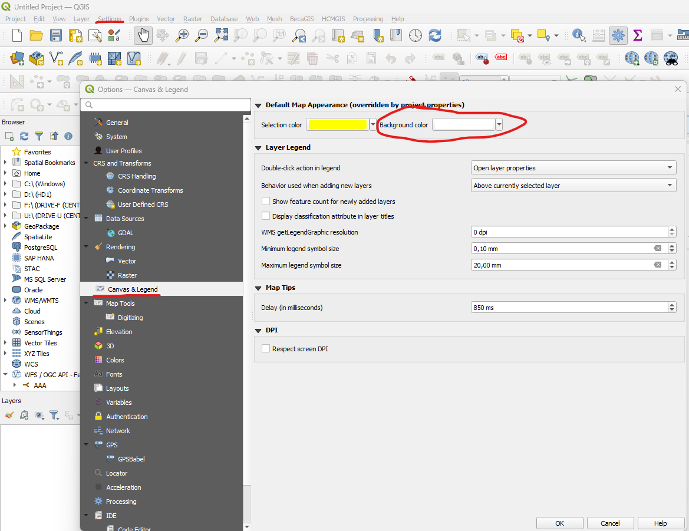
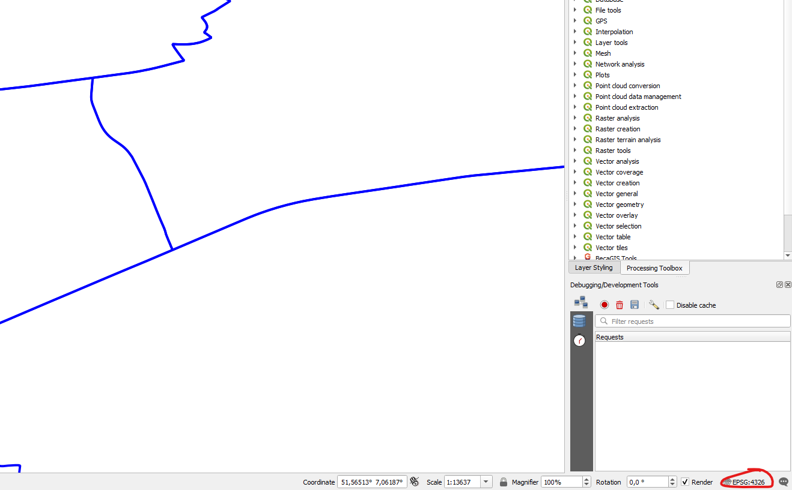
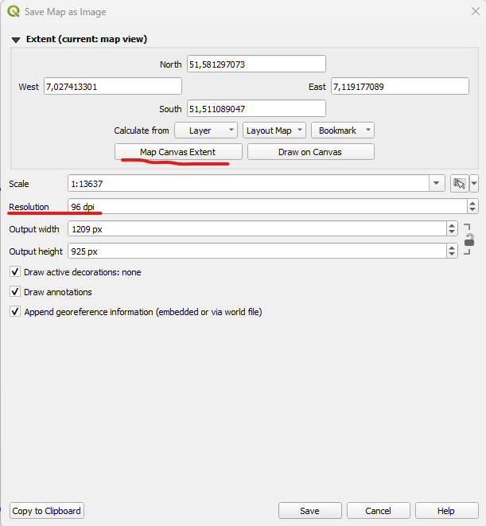
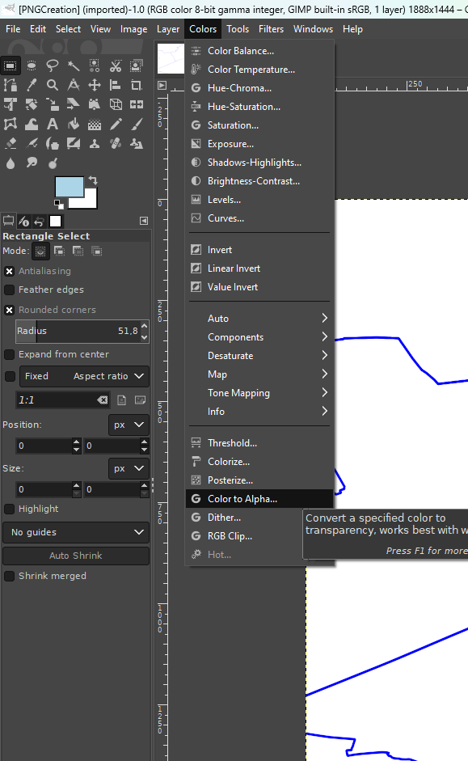
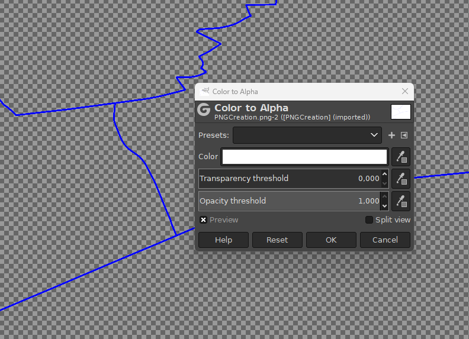
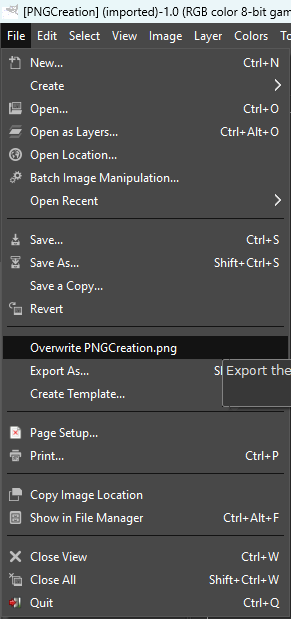

This guide shows how to generate georeferenced .png files (+ .pgw file) with QGIS. As of now, in contrast to vector files, raster files can receive shadows inside Cesium. Georeferenced .png files can be loaded through mixed layers into your 3d city model.

## 1. Export data from QGIS

To later make the background appear transparent, we need to swap colors in GIMP. Be careful that your background color doesn't match any other color in your data. Otherwise you would need to clip it manually in GIMP.

If you want to change the background color in QGIS, go to `settings`, then choose `map & legend` and set the background color accordingly.

Open all layers, style and reorganize them if necessary. Check if your project coordinate system is set to `EPSG:4326`. This is the native coordinate system for 2D data in Cesium.js.

Finally, export the map as an image via `Project` -> `Import/Export` -> `Export Map to Image...`.

In the export menu you can define the output resolution and set the export extent to the map canvas. Don't overdo it with the resolution, due to loading times 100 to 200 dpi is advised.

## 2. Make background transparent

Open GIMP and load the exported .png file. Then select `Colors` -> `Color to Alpha`. You can now pick a color value that should be represented as transparent. Tuning the transparency threshold can help broaden the applicable range.

After that overwrite the original png image.

You should now have a transformed .png and the original .pgw file (from QGIS), which then can be used inside the application.
